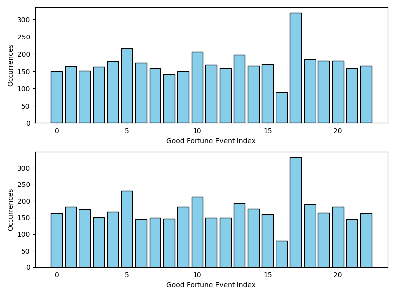

# Fortune Statistics

## Distribution of fortune

### 2000 IPs for 365 days, two groups in total

| Fortune Status  | Percentage (1st time)  | Percentage (2nd time)  |
|-----------------|------------------------|------------------------|
| 大吉            | 20.33%                 | 20.30%                 |
| 中吉            | 14.37%                 | 14.34%                 |
| 小吉            | 10.57%                 | 10.59%                 |
| 吉              | 14.49%                 | 14.44%                 |
| 末吉            | 10.14%                 | 10.24%                 |
| 中平            | 14.29%                 | 14.40%                 |
| 凶              | 8.64%                  | 8.60%                  |
| 大凶            | 7.17%                  | 7.09%                  |

## Distribution statistics of daily fortune events

Statistical method: The sum of the number of fortune events that occurred for 2,000 random IPs on the same day.

The x-axis is the index value and the y-axis is the number of times.

| 宜 (Good Fortune)                              | 忌 (Bad Fortune)                             |
|------------------------------------------------|----------------------------------------------|
|  |  |

[Statistics code](./main.js)
